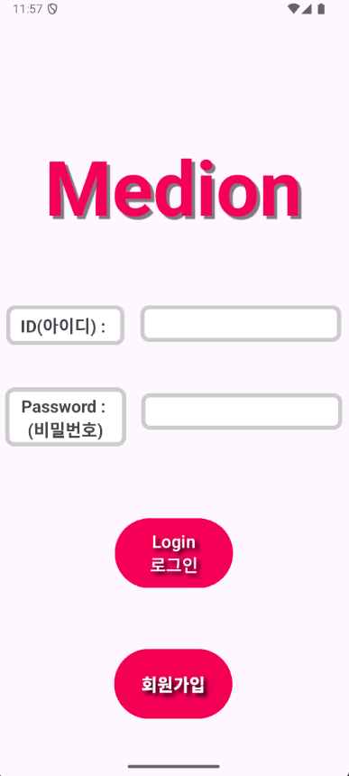

# 🩺 메디온 앱 (Medion App) 🏥

> 🩹 사용자 중심의 스마트 자가진단 솔루션

_▲ 메디온 앱의 메인 화면입니다._

## ✨ 프로젝트 소개

`메디온 앱`은 사용자가 자신의 건강 상태를 쉽고 빠르게 자가진단할 수 있도록 돕는 안드로이드 애플리케이션입니다. 발열, 통증과 같은 일반적인 증상뿐만 아니라, **카메라 기능을 활용하여 상처 부위 사진을 촬영하고 기록**함으로써 더욱 심층적인 자가진단 데이터를 축적할 수 있도록 설계되었습니다. 최종적으로는 이 데이터를 기반으로 한 **딥러닝 상처 분류 모델 개발**을 목표로 하고 있습니다.

---

## 🚀 주요 기능

### 1. 간편한 자가진단 시작

-   앱 실행 시 바로 자가진단 프로세스를 시작할 수 있는 직관적인 UI를 제공합니다.
-   초기 화면에서 '자가진단 시작' 버튼을 통해 즉시 기능에 접근할 수 있습니다.

### 2. 체온 측정 시뮬레이션

-   랜덤 값을 활용하여 사용자에게 가상의 체온 측정 결과를 제공하고, 자가진단의 실감을 더합니다.
-   `현재 온도: XX.XX °C` 형식으로 결과를 표시합니다.

### 3. 상처 촬영 및 기록

-   **카메라 앱 연동**: '사진 찍기' 버튼 클릭 시 기기의 기본 카메라 앱이 실행됩니다.
-   **상처 이미지 기록**: 촬영된 사진은 이후 딥러닝 기반 상처 분류 모델 개발을 위한 중요한 데이터로 활용됩니다.

### 4. 진단 기록 제출 및 분석

-   측정된 온도 및 촬영된 사진 등 수집된 진단 정보를 제출할 수 있습니다.
-   정보 처리 과정을 시각적으로 안내하기 위한 가상의 '분석 중' 로딩 화면을 제공합니다.
-   분석 완료 후 결과 화면으로 전환되어 요약 정보를 보여줍니다.

_▲ 자가진단 정보 분석 시 보여지는 화면입니다._

_▲ 자가진단 정보 분석 시 보여지는 로딩 화면입니다._

_▲ 자가진단 결과가 보여지는 화면입니다._

_▲ 자가진단 이 완료 되면 보여지는 화면입니다._

### 5. 사용자 로그인/회원가입 시스템

-   사용자별 진단 기록을 안전하게 관리하고 개인화된 서비스를 제공하기 위한 로그인 및 회원가입 기능이 구현되어 있습니다.
-   개별 계정을 통해 프라이버시를 보호하며 맞춤형 건강 관리가 가능합니다.

_▲ 사용자가 앱에 로그인하고 가입할 수 있는 화면입니다._

---

## 🛠️ 개발 환경 및 사용 기술

이 프로젝트는 다음과 같은 개발 환경 및 기술 스택을 활용하여 구축되었습니다.

*   **개발 언어**: `Kotlin`
*   **IDE**: `Android Studio` (Bumblebee 이상 버전 권장)
*   **최소 지원 Android 버전**: `API 21 (Android 5.0 Lollipop)` 이상
*   **빌드 도구**: `Gradle`
*   **주요 라이브러리/컴포넌트**:
    *   `AndroidX` (UI/UX 및 기본 시스템 기능 지원)
    *   `androidx.activity:activity-ktx` (ActivityResultLauncher 등)
